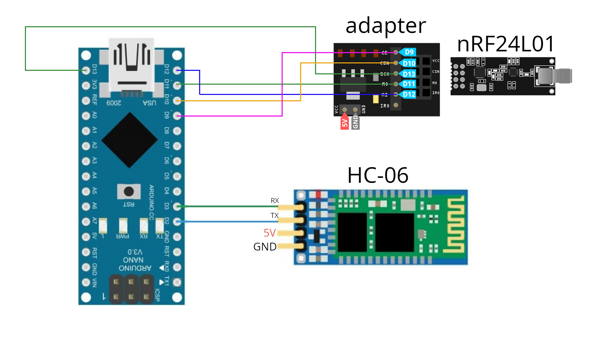
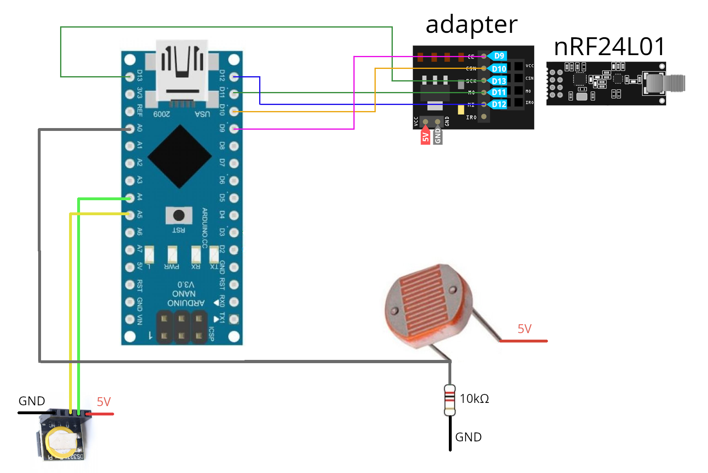

# SaigakTiming
Android app for measuring time of passing the distance in competitions.

Android приложение для измерения времени прохождения дистанции на соревнованиях, хронометраж.
Сейчас используется на эндуро вело соревнованиях, но может быть использовано и на других типах соревнований.

## Краткое описание принципа работы (техническая сторона)
Для проведения соревнования требуется телефон с ОС Android 5.1 и выше и установленным на него приложением, а также набор станций, сделанных на базе Arduino. Необходимы как минимум две станции: главная и финишная. Финишных станций может быть несколько.
Телефон соединяется при помощи Bluetooth с главной станцией. Главная станция при помощи радио модуля NRF24L01 соединяется с финишными станциями. Финишные станции могут быть удалены от главной станции на километр и более. Старт участника происходит по звуковому сигналу на телефоне. Финиш участника фиксируется станцией благодаря фоторезистору, на который светит лазер. При пересечении световой линии происходит срабатывание финишного датчика. Финишная станция фиксирует время срабатывания используя RTC модуль DS3231 и передаёт время на главную станцию, а она отправляет это время в приложение на телефон. Для более точных результатов перед стартом есть возможность синхронизировать время финишных станций с временем телефона.

    
## Стек технологий Android приложения

* Код написан на Kotlin
* Архитектура MVVM
* Dependency injection - Koin
* Для асинхронных операций использованы Coroutines, Flow, StateFlow, SharedFlow
* Доступ к БД при помощи Room.

## Реализовано

* Добавление и редактирование параметров соревнования.
* Добавление участников.
* Расчёт времени старта участника.
* Автоматический старт.
* Ручной старт.
* Возможность добавить штрафное время в случае фальстарта.
* Возможность пропустить текущего участника при неготовности стартовать конкретного человека или отправить его в конец списка.
* Возможность приостановить соревнование. Пауза.
* Возможность удалить ложную отметку о финише, если кто-то случайно прошёл через финишную линию, вызвав срабатывание датчика.
* Возможность выбрать конкретные старты участника, идущие в зачёт.
* Протокол соревнования.
* Архив соревнований.
* Синхронизация времени финишных датчиков с временем телефона.

## Скриншоты
 
 

## Arduino железо и схемы

Файлы прошивок находятся в каталоге Arduino. MasterNode - главная станция. SlaveNode - финишная станция. При наличии нескольких финишных станций необходимо прошить в них разный node address в промежутке от 01 - 05 (смотри файл SlaveNode.ino). Также необходимо скачать библиотеки Sodaq_DS3231, RF24Network, RF24.  При работе в Arduino IDE необходимо скопировать файл Node.h в каталог 'libraries/SaigakTiming'. 

### Схема главной станции

### Схема финишной станции

**Внимание!**
На схемах не нарисованы повышающий преобразователь на 5v для литеевого аккумулятора и кнопка включения. Также не стал рисовать схему лазера. Лазер через повышающий преобразователь соединяется акумулятором, плюс тоже есть кнопка включения.

### Набор радио компонентов с али для одной главной станции и двух финишных

* [Ардуина нано](https://aliexpress.ru/item/32341832857.html) 3 шт 
* [Модуль реального времени](https://aliexpress.ru/item/1005001557552298.html) 2шт
* [Импульсный повышающий модуль и зарядка для литеевой банки](https://aliexpress.ru/item/32923419688.html) 5 шт
* [Bluetooth HC-06](https://aliexpress.ru/item/4000587203886.html)
* [NRF24L01 с антеной](https://aliexpress.ru/item/32517849393.html) 3 шт
* [Модуль питания для NRF24L01](https://aliexpress.ru/item/4000587243566.html) 3 шт
* [Лазеры](https://aliexpress.ru/item/32843915409.html)
* [Фоторезисторы](https://aliexpress.ru/item/32623615207.html)
* [Кнопки](https://aliexpress.ru/item/4000169106856.html)

## Алгоритм соревнований применительно к участнику
1. Получить карточку участника с временами старта каждого СУ (Спец. Участок).
2. Добраться к старту и подготовиться к прохождению СУ1 в указанное время.
3. Проехать СУ1 максимально быстро.
4. Добраться к старту и подготовиться к прохождению СУ2 в указанное время.
5. Повторить пункты 2, 3 по количеству СУ.
